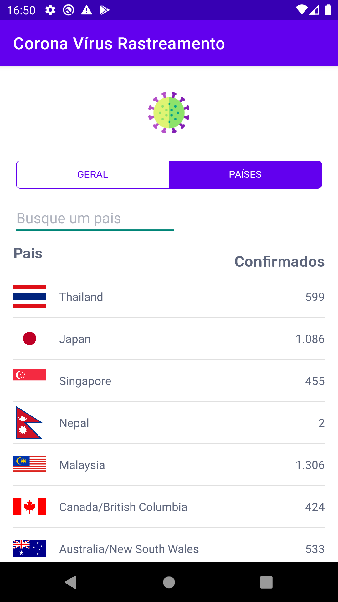

Corona Virus Tracking App
===============

An Android application to track the corona virus according to countries or globally

Languages available so far
- English
- Portuguese (Brazil)

API Used https://github.com/ExpDev07/coronavirus-tracker-api

More information about libraries used I'll post later.

License
---

	Copyright (c) 2020 Marlon Mafra

    Licensed under the Apache License, Version 2.0 (the "License");
    you may not use this file except in compliance with the License.
    You may obtain a copy of the License at

    http://www.apache.org/licenses/LICENSE-2.0

    Unless required by applicable law or agreed to in writing, software
    distributed under the License is distributed on an "AS IS" BASIS,
    WITHOUT WARRANTIES OR CONDITIONS OF ANY KIND, either express or implied.
    See the License for the specific language governing permissions and
    limitations under the License.

